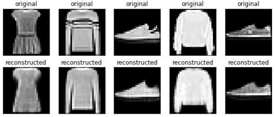
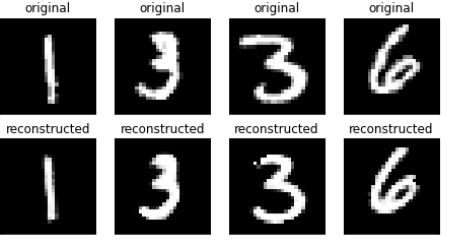
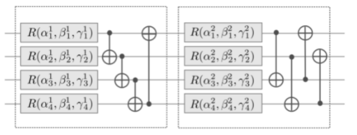

# QML-project

This folder contains result of research of Quantum Machine Learning sphere, applying algorithms and etc.

List of files:
1) [QNN.ipynb](./QNN.ipynb) - contains Jupyter notebook with simple Quantum-hybrid Neural Network for classification MNIST-Fashion dataset. Idea and main part of code gotten from [article](https://towardsdatascience.com/hybrid-quantum-neural-network-for-reduced-mnist-data-840897ad08a).
2) [qnn-final.ipynb](./qnn-final.ipynb) - contains Jupyter notebook with final Quantum-hybrid Neural Network for classification of some digits from MNIST dataset.

## Overview

Both files contain Quantum-hybrid Neural Network for classification. Both of them have same idea and same backbone, so, i will describe idea in general there and provide difference later.

### Part 1. Auto-encoder

First stage of processing is auto-encoder: due to our Neural Network is not convolutional, but fully-connected and our dataset are iamges, so, it is better to pass some encoded data, not original images. So, first step is autoencoding via fully-connected layers like this (MNIST version contains more layers, but structure is same)

```python
self.encoder = tf.keras.Sequential([
      Flatten(),
      Dense(196, activation='relu'),
      Dense(64, activation='relu'),
      Dense(latent_dim, activation='relu'),
])
self.decoder = tf.keras.Sequential([
      Dense(64, activation='relu'),
      Dense(196, activation='relu'),
      Dense(784, activation='sigmoid'),
      Reshape((28, 28))
])
```
, where `latent_dim` = `2^n_qubits`

Autoencoder has a very good quality of encoding and decoding:

Fashion dataset:


Mnist dataset:


So, to NN passed encoded values

### Part 2. Quantum-Neural-Network

Architecture of NN is pretty straight-forward:

```python
weight_shapes = {"weights": (num_layers,n_qubits,3)}

input_m = tf.keras.layers.Input(shape=(2 ** n_qubits,))
keras_1 = qml.qnn.KerasLayer(circuit, weight_shapes, output_dim=n_qubits)(input_m)
output  = tf.keras.layers.Dense(10, activation='softmax')(keras_1)
```

Main part is `qml.qnn.KerasLayer(circuit, weight_shapes, output_dim=n_qubits)` layer where `circuit` is Quantum-based function for layer. It looks like this:

```python
@qml.qnode(dev, diff_method='adjoint')
def circuit(weights, inputs=None):
  ''' Quantum QVC Circuit'''

  # 1
  weights_each_layer = tf.split(weights, num_or_size_splits=num_layers, axis=0)
  
  # 2
  inputs_1 = inputs / p_np.sqrt(max(p_np.sum(inputs ** 2, axis=-1), 0.001))

  for i in range(num_layers):
    # 3
    if i % 2 == 0:
      MottonenStatePreparation(inputs_1, wires = range(n_qubits))
    
    # 4
    StronglyEntanglingLayers(weights_each_layer[i], wires=range(n_qubits))
  
  # 5
  return [qml.expval(qml.PauliZ(i)) for i in range(n_qubits)] 
```

This function written with help of `pennylane` framework. Let's overview function line by line:

1) Split original list of weight to  weight per layer. Due to our fully-connected-quantum layer can have several layers (same as several fully-connected-classial layers), we have different weights for each layer
2) Normalize input
3) In for-loop over each layer we configure layers with gotten weights and input. First step is data re-uploading technique. The main idea is: 
   1) For first layer `i % 2 == 0 where i == 0`we obtain original image and pass it inside layer as in classical fully-connected layers. 
   2) Then on `i % 2 == 1` we ignore uploading of original image and apply weights to result of previous layer to make fully-connected layer with previous one
   3) With `i % 2 ==0` again we re-upload image to qubits to restore context
   4) To upload image to qubits used **Transformation of quantum states using uniformly controlled rotations**
4) StronglyEntanglingLayers is way to create fully connected layers with some "activation". A layer applying rotations on each qubit followed by cascades of 2-qubit entangling gates. For example, two 4-qubit strongly entangling layers with rotations R and CNOTs as imprimitives:

5) Measure state of all qubits. As a result, we obtain  classical bits which passed next to classical NN

### Part 3. Experimets:

[QNN.ipynb](./QNN.ipynb) contains experiment for MNIST-Fasion dataset. In this experiment i've used 6 qubits and 1 layer of qubits. Autoencoder achieved accuracy about 26%. 1 epoch was applied to train NN. Final accuracy on test is about 92%. With more layers i've achieved accuracy about 93-95%.

[qnn-final.ipynb](./qnn-final.ipynb) contains my own experiment of applying same techniques  to MNIST dataset. Due to MNIST dataset is more complicated i've used 6 qubits and 5 layers to make more connected and complex NN. Also it requried to build more complex Autoencoder (+1 layer) to provide better encoded results. Autoencoder accuracy about 31%. To achieve better results it was required to teach NN more epochs: i've applied 5 epochs to achieve 98% on train and 96% on test datasets. 

Such a NN has only 160 weights in total. I've compare this NN to same classical NNs.
1) NN with same amount of  weights:
```python
Dense(2, activation='relu'),
Dense(10, activation='softmax')
```
and it has only 94% of accuarcy after 5 epochs
2) NN with same hierarchy, but more weights:
```python
Dense(n_qubits*3, activation='relu'),
Dense(n_qubits*3, activation='relu'),
Dense(n_qubits*3, activation='relu'),
Dense(n_qubits*3, activation='relu'),
Dense(n_qubits*3, activation='relu'),
Dense(n_qubits*3, activation='relu'),
Dense(10, activation='softmax')
```
It has about 3,070 weights and 96-97% of accuracy after 5 epochs.

As a result we can say, that Quantum NN has some advantages comparing to classical NN:
1) Small amount of weights, but good enough accuaracy
2) Theoretically on real Quantum Computer it should works much faster
3) Pretty easy architecture of NN


## References:
- [Data re-uploading for a universal quantum classifier](https://arxiv.org/pdf/1907.02085.pdf)
- [Mottonen State Preparation article](https://arxiv.org/pdf/quant-ph/0407010.pdf)